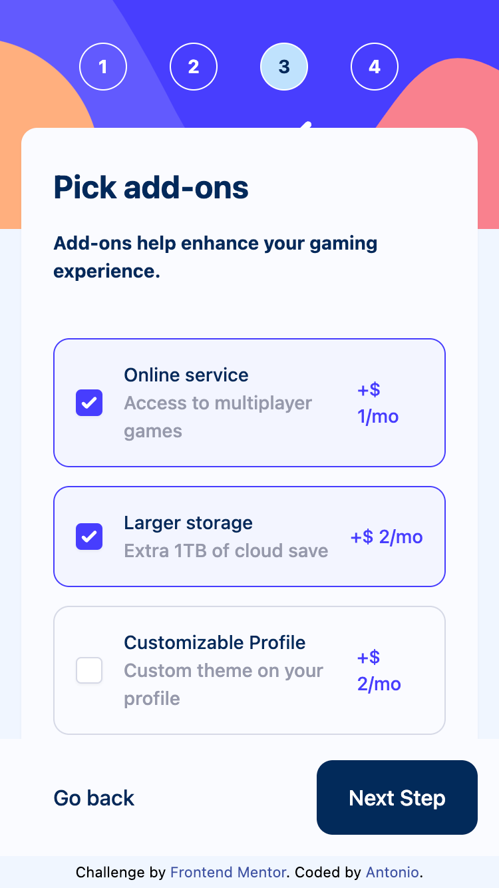

# Frontend Mentor - Multi-step form solution

This is a solution to the [Multi-step form challenge on Frontend Mentor](https://www.frontendmentor.io/challenges/multistep-form-YVAnSdqQBJ). Frontend Mentor challenges help you improve your coding skills by building realistic projects.

## Table of contents

- [Overview](#overview)
  - [The challenge](#the-challenge)
  - [Screenshot](#screenshot)
  - [Links](#links)
- [My process](#my-process)
  - [Built with](#built-with)
  - [What I learned](#what-i-learned)
  - [Continued development](#continued-development)
  - [Useful resources](#useful-resources)
- [Author](#author)
- [Acknowledgments](#acknowledgments)

**Note: Delete this note and update the table of contents based on what sections you keep.**

## Overview

### The challenge

Users should be able to:

- Complete each step of the sequence
- Go back to a previous step to update their selections
- See a summary of their selections on the final step and confirm their order
- View the optimal layout for the interface depending on their device's screen size
- See hover and focus states for all interactive elements on the page
- Receive form validation messages if:
  - A field has been missed
  - The email address is not formatted correctly
  - A step is submitted, but no selection has been made

### Screenshot





### Links

- Solution URL: [Add solution URL here](https://your-solution-url.com)
- Live Site URL: [Add live site URL here](https://your-live-site-url.com)

## My process

### Built with

- Semantic HTML5 markup
- CSS custom properties
- Flexbox
- CSS Grid
- Mobile-first workflow
- Typescript
- [React](https://reactjs.org/) - JS library
- [Tailwindcss](https://tailwindcss.com) - Tailwindcss

**Note: These are just examples. Delete this note and replace the list above with your own choices**

### What I learned

- Create a component from scratch using React JS and styling seperated components with all CSS using utilities classes first approach;
- Using third-party react's state management to handle the state of interactive button;
- Using conditional react's to selective routing to a certain component;
- Applying typescript for a safety checking and consistent of react's types;
- Using zustand library with multiple storage to handle the form input as well as branch routing for every step submission;

To see how you can add code snippets, see below:

```js
const formStep = sideBar.length;

const useStep = create<{
  isConfirmed: boolean;
  currentIndex: number;
  isFirstStep: boolean;
  isLastStep: boolean;
  actions: {
    goForward: () => void;
    goBackWard: () => void;
    goToSection: (item: number) => void;
    setConfirm: () => void;
  };
}>((set, get) => ({
  isConfirmed: false,
  currentIndex: 0,
  isFirstStep: true,
  isLastStep: false,
  actions: {
    goForward: () => {
      if (get().currentIndex === formStep - 1) return;
      const currentIndex = get().currentIndex + 1;
      set({
        currentIndex,
        isFirstStep: false,
        isLastStep: currentIndex === formStep - 1,
        isConfirmed: false,
      });
    },
    goBackWard: () => {
      if (get().currentIndex === 0) return;
      const currentIndex = get().currentIndex - 1;
      set({
        currentIndex,
        isFirstStep: currentIndex === 0,
        isLastStep: false,
        isConfirmed: false,
      });
    },
    goToSection: (item: number) => {
      set({
        currentIndex: item,
        isFirstStep: item === 0,
        isLastStep: item === formStep - 1,
        isConfirmed: false,
      });
    },
    setConfirm: () => {
      set({ isConfirmed: true, currentIndex: formStep + 1 });
    },
  },
}));
```

### Continued development

- I am going to keep trying to have a good grasp of using Tailwinds class in advanced projects.
- Striving to implement the async state management like react-query to manage the data locally and get up-to-date in the future projects.

### Useful resources

- [Zustand](https://github.com/pmndrs/zustand)
- [Tailwind CSS](https://tailwindcss.com/)
- [Multi-page Form with React](https://www.youtube.com/watch?v=QSBc8bABwE0&list=PL0Zuz27SZ-6PrE9srvEn8nbhOOyxnWXfp&index=51&pp=iAQB)

## Author

- Frontend Mentor - [@Antonio0402](https://www.frontendmentor.io/profile/Antonio0402)

## Acknowledgments

So much thanks specially to Dave Gray Youtube Chanel for absolute amazing and thoroughly knowledges about how ReactJS and tutorials to help you acquaint with the details of "how to..." creating features in real React projects.
